# TenderPocket — Enterprise Tender Management & Workflow Automation System

TenderPocket is an enterprise-grade web application and automation platform engineered for government and commercial tender tracking, GeM (Government e-Marketplace) portal synchronization, multi-department approval pipelines, and automated bid document compilation.

---

## 🏗️ Monorepo & System Architecture

TenderPocket features a modular full-stack architecture with a Next.js 16 (React 19) frontend and a Java 21 Spring Boot 3 enterprise service:

```
tender-pocket/
├── frontend/                                # Next.js 16 (React 19, Tailwind CSS 4)
│   ├── src/app/                             # App Router pages and API routes
│   │   ├── page.tsx                         # Role-Aware Dashboard & Approvals Center Drawer
│   │   ├── tenders/[id]/page.tsx            # Full-screen Tender Workspace & 8-Stage Stepper
│   │   ├── components/                      # Modular UI Components
│   │   │   ├── ApprovalsDrawer.tsx          # Unified Cross-Role Approvals Center Drawer
│   │   │   ├── DashboardHeader.tsx          # Navigation, Role Switcher & Real-time Stats
│   │   │   └── ...                          # Tender tables, filters, and modal dialogs
│   │   └── api/                             # SQLite Handlers & Spring Boot Proxy Routes
│   │       ├── approvals/                   # Centralized Approvals & Review Pipeline
│   │       ├── tenders/[id]/                # Clearance, TPC, MIS Price, Bid Docs, Payment
│   │       └── auth/                        # Role authentication & user management
│   ├── src/lib/                             # Shared Utilities & Business Logic
│   │   ├── db.ts                            # SQLite Schema, Migrations, Auto-Seeders
│   │   ├── auth.ts                          # JWT Token verification & Role extraction
│   │   └── approvalsSync.ts                 # Request Deduplication & Cross-DB Reconciler
│   ├── scripts/                             # Test automation & portal sync scripts
│   │   ├── test-complete-workflow-suite.js  # 20-Point Automated Verification Suite
│   │   ├── sync-gem.js                      # GeM Portal Scraper & Sync
│   │   └── sync-emails.js                   # IMAP Mail Notification Parser
│   └── package.json                         # Configured for default dev port 8085
├── backend/                                 # Java 21 / Spring Boot 3 Enterprise Service
│   ├── src/main/java/com/tenderpocket/
│   │   ├── controllers/                     # REST Controllers (ApprovalController, TenderController)
│   │   ├── models/                          # JPA Entities (Tender, TenderApproval, User)
│   │   ├── repositories/                    # Spring Data Repositories
│   │   ├── services/                        # Scrapers, AI Analyzers, Document Generators
│   │   └── config/                          # Security, JWT (HS256/HS512), CORS Configuration
│   ├── src/main/resources/
│   │   └── application.properties           # PostgreSQL / Port 8090 configuration
│   └── pom.xml                              # Maven build specifications
├── TASK_CHANGELOG.md                        # Exhaustive changelog of all architectural enhancements
├── LOCAL_CHANGES_REPORT.md                  # Git delta and file audit report
├── .env.example                             # Unified root environment template
└── README.md                                # Comprehensive system documentation
```

### Resilient Dual-Database Architecture

- **Local SQLite Database (`frontend/tenders.db`)**: Provides instant, zero-configuration local persistence out of the box with zero external dependencies. Ideal for offline work, local development, and branch testing.
- **PostgreSQL Database (`backend/`)**: Provides enterprise-grade clustering, row-level locking, and transactional integrity when running the Spring Boot backend.
- **Transparent Failover / Hybrid Proxying**: Frontend API routes automatically attempt to communicate with the Spring Boot service (`http://localhost:8090`). If the backend is offline, the frontend seamlessly executes operations against local SQLite without breaking the user experience.

---

## 🔄 The 8-Stage GeM Tender Approval & Document Lifecycle

TenderPocket implements a strictly gated, sequential role-based approval pipeline to guarantee specification compliance, commercial pricing confidentiality, document verification, and submission accountability.

### End-to-End Workflow Diagram

```mermaid
flowchart TD
    %% Nodes
    START([Tender Discovered / Scraped]) --> S1[Stage 1: Spec Upload & Clearance]
  
    subgraph S1_BOX [Stage 1: Specification Clearance]
        S1 --> S1_ACT[Tender Executive uploads Tech Spec]
        S1_ACT --> S1_REQ[Clearance Request Initiated]
        S1_REQ --> S1_REV{Clearance Team Review}
        S1_REV -->|Rejected / Rework| S1_REJ[Status: DRAFT / REWORK<br/>Feedback sent to Executive]
        S1_REJ --> S1_ACT
        S1_REV -->|Approved| S2[Stage 2: TPC Pricing Review]
    end

    subgraph S2_BOX [Stage 2: TPC Manufacturer Pricing]
        S2 --> S2_ACT[TPC Pricing Team contacts OEM]
        S2_ACT --> S2_INP[Input Confidential Purchase Price & Terms]
        S2_INP --> S2_SEC[🔒 Purchase Price Masked from Executive]
        S2_SEC --> S3[Stage 3: MIS Pricing Review]
    end

    subgraph S3_BOX [Stage 3: MIS Pricing]
        S3 --> S3_ACT[MIS Team reviews TPC Quote & Margins]
        S3_ACT --> S3_REV{MIS Price Set?}
        S3_REV -->|Rejected| S3_REJ[Returned to TPC for Revision]
        S3_REJ --> S2_ACT
        S3_REV -->|Approved Final Price| S4[Stage 4: Docs Prep - Bid Generation]
    end

    subgraph S4_BOX [Stage 4: Document Preparation]
        S4 --> S4_GATE{Gated Check:<br/>Spec Approved + MIS Price Set?}
        S4_GATE -->|No| S4_BLOCK[Locked: Generation Blocked]
        S4_GATE -->|Yes| S4_GEN[Executive configures MAF, Undertaking & Compliance]
        S4_GEN --> S4_DOCX[Engine Compiles DOCX & PDF Bid Pack]
        S4_DOCX --> S4_SUB[Executive Submits Docs for Verification]
        S4_SUB --> S5[Stage 5: Document Verification]
    end

    subgraph S5_BOX [Stage 5: Document Verification]
        S5 --> S5_REV{MIS Team Document Review}
        S5_REV -->|Rejected / Corrections| S5_REJ[Status: REVISE_DOCS<br/>Executive updates attachments]
        S5_REJ --> S4_GEN
        S5_REV -->|Approved| S6[Stage 6: EMD Payment Processing]
    end

    subgraph S6_BOX [Stage 6: EMD / Security Deposit Payment]
        S6 --> S6_LOCK{Strict Lock:<br/>Docs Approved by MIS?}
        S6_LOCK -->|No| S6_BLOCKED[Locked: Payment Disabled]
        S6_LOCK -->|Yes| S6_PAY[MIS / Finance verifies EMD Exemption / Records Transaction]
        S6_PAY --> S6_REV{Payment Verified?}
        S6_REV -->|Rejected| S6_REJ[Payment Correction Required]
        S6_REJ --> S6_PAY
        S6_REV -->|Approved| S7[Stage 7: Final Portal Submission]
    end

    subgraph S7_BOX [Stage 7: GeM Portal Submission]
        S7 --> S7_SUB[MIS Team validates complete Bid Pack on GeM]
        S7_SUB --> S7_REC[Record GeM Bid Reference & Ack Slip]
        S7_REC --> S8[Stage 8: Tender Outcome Tracking]
    end

    subgraph S8_BOX [Stage 8: Outcome & Post-Bid Analysis]
        S8 --> S8_DEC{Bid Result}
        S8_DEC -->|Won| S8_WON([🏆 Status: WON<br/>Award Contract & Record Margins])
        S8_DEC -->|Lost| S8_LOST([❌ Status: LOST<br/>Record L1 Price & Loss Reason])
        S8_DEC -->|Disqualified| S8_DQ([⚠️ Status: DISQUALIFIED<br/>Record Technical Cause])
    end

    %% Style
    classDef approved fill:#dcfce7,stroke:#16a34a,stroke-width:2px;
    classDef rejected fill:#fee2e2,stroke:#dc2626,stroke-width:2px;
    classDef locked fill:#fef3c7,stroke:#d97706,stroke-width:2px;
    class S8_WON approved;
    class S1_REJ,S3_REJ,S5_REJ,S6_REJ,S8_LOST,S8_DQ rejected;
    class S4_BLOCK,S6_BLOCKED locked;
```



---

### Detailed Stage Breakdown

| Stage       | Name                                 | Key Actor          | System Stage Code                          | Gating Precondition                                       | Description                                                                                                                                    |
| :---------- | :----------------------------------- | :----------------- | :----------------------------------------- | :-------------------------------------------------------- | :--------------------------------------------------------------------------------------------------------------------------------------------- |
| **1** | **Spec Clearance**             | Clearance Team     | `CLEARANCE_PENDING` / `SPEC_CLEARANCE` | Tech specs uploaded by Executive                          | Clearance Team inspects technical parameters, certifications, and drawings. Can approve to next stage or reject with specific rework feedback. |
| **2** | **TPC Pricing**                | TPC Pricing Team   | `TPC_PRICING`                            | Stage 1 approved                                          | TPC contacts OEM/vendors and enters manufacturer purchase price (`tpc_purchase_price`) and warranty/delivery terms.                          |
| **3** | **MIS Pricing**                | MIS Team           | `MIS_PRICING`                            | Stage 2 completed                                         | MIS Team reviews OEM base cost, applies organizational margin, and sets the final selling price (`mis_final_price`).                         |
| **4** | **Docs Prep (Bid Generation)** | Tender Executive   | `BID_DOC_PENDING`                        | Stage 1 approved**AND** Stage 3 MIS price finalized | Executive prepares attachments, inputs compliance parameters, and generates final DOCX/PDF bid documents.                                      |
| **5** | **Document Verification**      | MIS Team           | `DOC_VERIFICATION`                       | Stage 4 bid docs compiled                                 | MIS Team reviews compiled documents for legal compliance, signatures, and format errors before releasing funds.                                |
| **6** | **EMD Payment**                | MIS Team / Finance | `PAYMENT_PENDING`                        | Stage 5 bid docs**APPROVED** by MIS Team            | EMD payment released; transaction reference, BG number, or exemption certificate recorded.                                                     |
| **7** | **GeM Submission**             | MIS Team           | `SUBMISSION_PENDING`                     | Stage 6 EMD paid/exempt                                   | Bid pack uploaded to GeM; acknowledgment slip recorded and verified. Tender moves to`SUBMITTED`.                                             |
| **8** | **Outcome & Analysis**         | MIS Team           | `SUBMITTED` &rarr; `WON`/`LOST`      | Portal results declared                                   | Post-bid opening analysis: records final status (`WON`, `LOST`, `DISQUALIFIED`), competitor prices, and learnings.                       |

---

## 🔒 Role-Based Permissions & Confidentiality Matrix

TenderPocket enforces role-based access control (RBAC) at both the Next.js API layer and the Spring Boot controller layer.

| Feature / Action                                            |  Tender Executive  | Clearance Team | TPC Pricing Team |  MIS Team  | Admin |
| :---------------------------------------------------------- | :----------------: | :------------: | :--------------: | :--------: | :---: |
| **Discover & View Tenders**                           |         ✅         |       ✅       |        ✅        |     ✅     |  ✅  |
| **Upload Technical Specs**                            |         ✅         |       ❌       |        ❌        |     ❌     |  ✅  |
| **Approve / Reject Tech Specs**                       |         ❌         |       ✅       |        ❌        |     ❌     |  ✅  |
| **Input Manufacturer Quote (`tpc_purchase_price`)** |         ❌         |       ❌       |        ✅        |     ❌     |  ✅  |
| **View Manufacturer Quote (`tpc_purchase_price`)**  | 🚫**MASKED** |       ❌       |        ✅        |     ✅     |  ✅  |
| **Set Final Selling Price (`mis_final_price`)**     |         ❌         |       ❌       |        ❌        |     ✅     |  ✅  |
| **Generate Bid Documents (DOCX/PDF)**                 |     ✅ (Gated)     |       ❌       |        ❌        |     ❌     |  ✅  |
| **Verify & Approve Bid Documents**                    |         ❌         |       ❌       |        ❌        |     ✅     |  ✅  |
| **Process / Record EMD Payment**                      |         ❌         |       ❌       |        ❌        | ✅ (Gated) |  ✅  |
| **Record GeM Submission**                             |         ❌         |       ❌       |        ❌        |     ✅     |  ✅  |
| **Record Final Outcome (Won/Lost)**                   |         ❌         |       ❌       |        ❌        |     ✅     |  ✅  |
| **User Management & Audit Logs**                      |         ❌         |       ❌       |        ❌        |     ❌     |  ✅  |

### Commercial Confidentiality Guarantee

The matrix also applies to direct API calls and generic tender updates, not only
visible buttons. Legacy `MIS Executive` / `Executive` accounts are treated as
Tender Executives, `Specification Team` as Clearance Team, and `TPC Team` as TPC
Pricing Team. An invalid supplied JWT never falls back to role headers.
Authenticated teams may read a minimal username/role directory for assignments;
user-management operations, detailed account statistics, and audit logs are
Admin-only. Manufacturer pricing and cached pricing summaries are hidden from
both Executive and Clearance roles, including nested API responses.

To protect sensitive vendor pricing, `tpc_purchase_price` is **strictly stripped and redacted** whenever an authenticated user with role `Tender Executive` requests tender data. Even if inspected via browser developer tools or network logs, the JSON response never contains the purchase price field for the Executive role.

---

## 🗂️ Approvals Center Architecture

The Approvals Center is a centralized workflow hub accessible via the **Approvals Drawer** or dedicated navigation tabs:

1. **Role-Specific Tab Views**:
   - `Clearance Team` sees pending Technical Specification reviews.
   - `TPC Pricing Team` sees tenders requiring OEM purchase quotes.
   - `MIS Team` sees pricing reviews, document verifications, EMD payments, and submission approvals.
   - `Admin` has a comprehensive view across all pending department stages.
2. **Request Deduplication & Uniqueness**:
   - Resubmitting a clearance or document request for a tender that already has an active pending request updates the existing record rather than creating duplicate queue items.
3. **Audit Trail & Feedback History**:
   - Every approval, rejection, or rework request requires a mandatory comment, permanently appended to the tender's audit timeline.

---

## 💻 System Prerequisites

| Requirement            | Recommended Version           | Minimum Version | Purpose                                                                        |
| :--------------------- | :---------------------------- | :-------------- | :----------------------------------------------------------------------------- |
| **Node.js**      | `v24.x`                     | `v22.12.0`    | Next.js frontend, document engine, test suites; Puppeteer requires Node 22.12+ |
| **npm**          | `v10.x`                     | `v9.x`        | Node package manager                                                           |
| **Java JDK**     | `Java 21` (Eclipse Temurin) | `Java 17`     | Optional: Spring Boot enterprise backend                                       |
| **Apache Maven** | `v3.9.x`                    | `v3.8.x`      | Optional: Building Java backend                                                |
| **PostgreSQL**   | `v16.x`                     | `v14.x`       | Optional: Enterprise database clustering                                       |

---

## ⚙️ Environment Configuration

### 1. Frontend Configuration (`frontend/.env.local`)

Copy the frontend environment template:

```bash
# Windows PowerShell
Copy-Item frontend/.env.example frontend/.env.local

# Linux / macOS
cp frontend/.env.example frontend/.env.local
```

Key environment variables:

```dotenv
PORT=8085
NEXT_PUBLIC_APP_URL=http://localhost:8085
BACKEND_URL=http://localhost:8090
JWT_SECRET=9a6156a5c2d3a3f5a2f8c5b8e9b6a1c8d5e6f3b2a5c8d3e4f5a8b9c1d2e3f4a5
DATABASE_PATH=./tenders.db
```

### 2. Backend Configuration (`backend/.env` or `application.properties`)

```dotenv
PORT=8090
SPRING_PORT=8090
DATABASE_URL=jdbc:postgresql://localhost:5432/tenderpocket
DATABASE_USERNAME=postgres
DATABASE_PASSWORD=postgres
JWT_SECRET=9a6156a5c2d3a3f5a2f8c5b8e9b6a1c8d5e6f3b2a5c8d3e4f5a8b9c1d2e3f4a5
```

---

## 🚀 How to Run the Application

### Option A: Running the Frontend (Port 8085 — Standalone Mode)

The frontend runs standalone with zero external dependencies using its built-in SQLite database:

```bash
cd frontend
npm install
npm run dev
```

Open your browser at: 👉 **[http://localhost:8085](http://localhost:8085)**

#### Customizing the Port:

- **npm**: `npm run dev -- -p 8086`
- **PowerShell**: `$env:PORT="8086"; npm run dev`
- **Bash**: `PORT=8086 npm run dev`

---

### Option B: Running the Spring Boot Backend (Port 8090)

```bash
cd backend
mvn spring-boot:run
```

Or run the production JAR:

```bash
mvn clean package -DskipTests
java -jar target/tender-pocket-spring-0.0.1-SNAPSHOT.jar
```

The Spring Boot backend will bind to: 👉 **[http://localhost:8090](http://localhost:8090)**

---

## 👥 Default User Accounts

The database auto-seeds the following role-based test accounts upon startup:

| Username                | Role                       | Default Password | Dashboard & Functional Responsibility                                     |
| :---------------------- | :------------------------- | :--------------- | :------------------------------------------------------------------------ |
| **`admin`**     | **Admin**            | `Marken@123$`  | Full system oversight, audit logs, user management, overrides.            |
| **`executive`** | **Tender Executive** | `executive123` | Specification uploads, bid document prep (DOCX/PDF).                      |
| **`clearance`** | **Clearance Team**   | `clearance123` | Technical specification reviews, approvals, and rework feedback.          |
| **`tpc`**       | **TPC Pricing Team** | `tpc123`       | OEM quotes, manufacturer pricing (confidential).                          |
| **`misteam`**   | **MIS Team**         | `misteam`      | Final pricing, doc verification, EMD payments, GeM submissions, outcomes. |

---

## 🧪 Comprehensive Automated Test Suite

TenderPocket includes a 20-point automated end-to-end verification suite covering the entire 8-stage lifecycle, rejection handling, request uniqueness, and role confidentiality boundaries.

### Running the Test Suite

Make sure the frontend is running on `http://localhost:8085`, then run:

```bash
node frontend/scripts/test-complete-workflow-suite.js
```

### Verified Test Cases

```
======================================================================
     TENDERPOCKET COMPREHENSIVE 20-POINT WORKFLOW TEST SUITE
======================================================================

[SECTION 1: HAPPY PATH (8 SEQUENTIAL STAGES)]
  [TEST 1] Create Fresh Tender & Upload Spec (CLEARANCE_PENDING) -> PASSED
  [TEST 2] Clearance Team Reviews & Approves Spec -> PASSED
  [TEST 3] TPC Team Enters Purchase Price Quote -> PASSED
  [TEST 4] MIS Team Enters Final Selling Price -> PASSED
  [TEST 5] Gating Check: Premature Generation Blocked -> PASSED
  [TEST 6] Executive Generates Bid Documents Pack (DOCX & PDF) -> PASSED
  [TEST 7] MIS Team Verifies & Approves Generated Bid Documents -> PASSED
  [TEST 8] MIS Team Verifies EMD Payment -> PASSED
  [TEST 9] MIS Team Confirms Final Portal Submission -> PASSED
  [TEST 10] Record Winning Tender Outcome -> PASSED

[SECTION 2: REJECTION & FEEDBACK LOOPS]
  [TEST 11] Spec Clearance Rejection & Rework Feedback Loop -> PASSED
  [TEST 12] Document Verification Rejection & Revision Notes -> PASSED
  [TEST 13] Payment Verification Rejection & Resubmission -> PASSED
  [TEST 14] Submission Verification Rejection & Correction -> PASSED
  [TEST 15] Bid Outcome: Lost with Reason & Competitor Data -> PASSED

[SECTION 3: UNIQUENESS & DEDUPLICATION]
  [TEST 16] Duplicate Clearance Submissions Update Existing Request -> PASSED
  [TEST 17] Resubmission After Rejection Updates Existing Request -> PASSED

[SECTION 4: CROSS-ROLE SECURITY & CONFIDENTIALITY]
  [TEST 18] Confidential Price Masking: Executive Cannot See TPC Purchase Price -> PASSED
  [TEST 19] Role Boundary: Executive Cannot Review Approvals (403 Forbidden) -> PASSED
  [TEST 20] Team Role Authorization: Clearance reviews Spec, TPC reviews Pricing -> PASSED

======================================================================
TOTAL TESTS: 20 | PASSED: 20 | FAILED: 0
SUCCESS RATE: 100.0%
======================================================================
```

---

## 🐳 Docker Deployment

Multi-stage container definitions are included for containerized deployment:

```bash
# Frontend container (Port 8085)
cd frontend
docker compose up -d --build

# Backend container (Port 8090)
cd backend
docker compose up -d --build
```

---

## 🔍 Troubleshooting & FAQs

### 1. `EADDRINUSE: address already in use`

- Port `8085` or `8090` is already bound.
- Inspect bound ports: `netstat -ano | findstr 8085` (Windows) or `lsof -i :8085` (Mac/Linux).
- Update `PORT=8086` in `frontend/.env.local` or `SPRING_PORT=8092` in `backend/application.properties`.

### 2. Can the frontend run without PostgreSQL or Spring Boot?

- **Yes**: The frontend runs completely standalone via `frontend/tenders.db` (SQLite). All approval queues, document generation, and role workflows function seamlessly.

### 3. Missing or corrupted SQLite database

- Simply start the application (`npm rboot`
- `un dev`) or seed sample tenders (`node frontend/scripts/seed-workflow-tenders.js`). The schema auto-migrates and seeds users automatically.

---

## 📄 Documentation Links

- Detailed Engineering Changelog: [TASK_CHANGELOG.md](TASK_CHANGELOG.md)
- Local Code Changes Audit: [LOCAL_CHANGES_REPORT.md](LOCAL_CHANGES_REPORT.md)
